# Running Dify on Kubernetes - Local Minikube Setup

### Goals:
- Deploy the Dify project using Kubernetes
- Access Frontend (FE) at: `http://localhost:8008`
- Access Backend (BE) endpoints at:
  - `http://localhost:8008/api`
  - `http://localhost:8008/console/api`
  - `http://localhost:8008/v1`

---

## Preparation

### Reference Materials:
- GitHub Repository: [Winson-030/dify-kubernetes](https://github.com/Winson-030/dify-kubernetes)

---

## Implementation Steps

1. **Run with Docker Containers**  
   Start by running Dify via Docker containers to understand the project components and their interactions.

2. **Build Using Native Dify Docker Compose**  
   Use the official Dify Docker Compose setup to build and test the application locally.

3. **Adapt Kubernetes YAML Files**  
   Use the YAML configurations from the [referenced repository](https://github.com/Winson-030/dify-kubernetes) as a base for Kubernetes deployment.

4. **Validate Local Pod Execution**  
   Ensure all pods and services are running correctly in the local Minikube cluster before proceeding.

## Kubernetes Implementation

### Preparation:
- **Identify required images to build**
- **Configure service YAML files**  
  - Use private images for critical components
  - Use public images for supporting services

### Reference Components:
- Sandbox Service: [langgenius/dify-sandbox](https://github.com/langgenius/dify-sandbox)
- Plugin Daemon Service: [langgenius/dify-plugin-daemon](https://github.com/langgenius/dify-plugin-daemon)

**Components using private images**:
- API
- Web
- Worker

**Components using public images**:
- Nginx
- PostgreSQL
- Redis
- SSRF

---

## Implementation Steps

1. **Build Docker Images**  
   Use the native Dockerfiles from `./dify/api` and `./dify/web`:

   ```powershell
   # Build API image
   cd ./dify/api
   minikube -p minikube docker-env --shell=powershell | Invoke-Expression
   docker build -t dify-api:local .

   # Build Web image
   cd ./dify/web
   minikube -p minikube docker-env --shell=powershell | Invoke-Expression
   docker build -t dify-web:local .

2. **Create YAML Configuration for Each Service**  
    Ensure all configurations consistently use the `dify` namespace.

    <p align="left">
        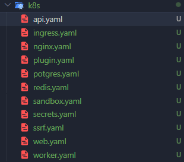
    </p>

3. **Push YAML Configuration to GitHub**  
    Repository: [nurwandi/dify-k8s](https://github.com/nurwandi/dify-k8s.git)

4. **Set Environment Variables for Minikube Docker**  
    ```powershell
   & minikube -p minikube docker-env --shell=cmd | ForEach-Object {
       if ($_ -match '^SET\s+(\w+)=(.+)$') {
           Set-Item -Path "env:$($matches[1])" -Value "$($matches[2])"
       }
   }
   ```
5. **Build service pods within the `dify` namespace**   
    Ensure the namespace `dify` is created using the command:  
    ```bash
    kubectl create namespace dify --dry-run=client -o yaml | kubectl apply -f -
    ```  
    Navigate to the YAML configuration folder:  
    ```bash
    cd dify-k8s
    ```  
    Execute the following command to deploy the service pods:  
    ```bash
    kubectl apply -f .
    ```  
    <p align="left">
        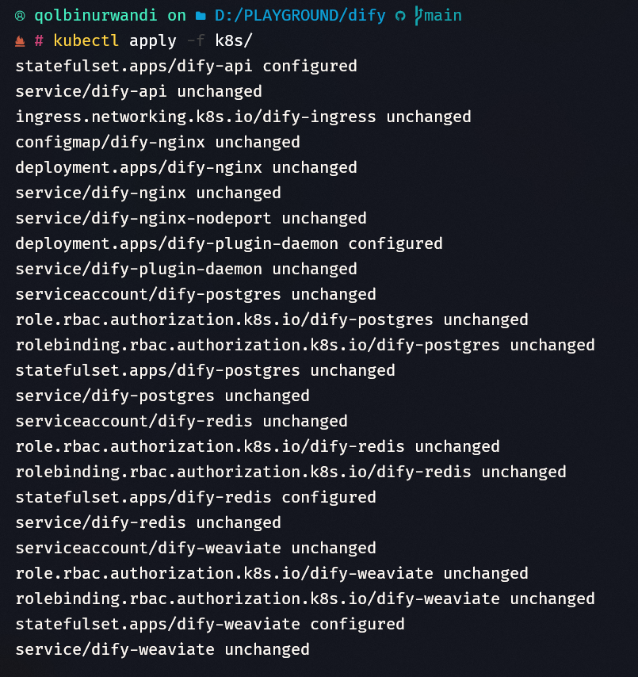
    </p>

6. **Verify that all services are running, healthy, and free of anomalies such as self-restarts**  
    Use the following command to check the status:  
    ```bash
    kubectl get pods -n dify -o wide
    ```  
    <p align="left">
        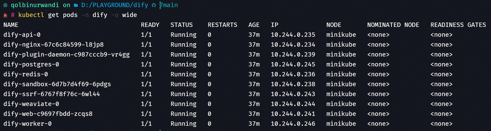
    </p>

If everything looks good, proceed to implement CI/CD.

## CI/CD Implementation in Jenkins

Here I use Jenkins that runs on my local on http://localhost:8888  
The made a Jenkinsfile which can be found here https://github.com/nurwandi/dify-k8s-jenkinsfile.git  

<p align="left">
    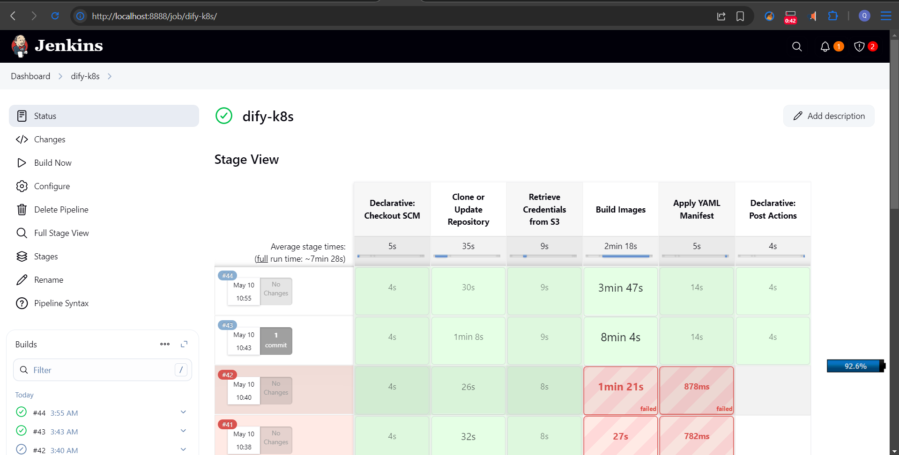
</p>

### Agent & Environment Variables

- **Agent:** The pipeline runs on a node labeled `victus`, which is my local laptop.
- **Environment Variables:**
    - **Repositories:**
        - `DIFY_REPOSITORY`: https://github.com/langgenius/dify.git
        - `DIFY_YAML_MANIFEST`: https://github.com/nurwandi/dify-k8s.git
        - `DIFY_SANDBOX`: https://github.com/langgenius/dify-sandbox.git
        - `DIFY_DAEMON_PLUGIN`: https://github.com/langgenius/dify-plugin-daemon.git
    - **Local Paths:**
        - `BUILDS_PATH`: `D:\TECHNICAL TEST`
        - `DIFY_REPOSITORY_PATH`, `DIFY_YAML_MANIFEST_PATH`, etc.
- **File Organization:**
```
D:/TECHNICAL TEST/
│
├── dify/
│   ├── api/
│   ├── web/
│   └── dify-k8s/
│       ├── dify-plugin-daemon/
│       ├── dify-sandbox/
│       ├── api.yaml
│       ├── nginx.yaml
│       └── ...
```

Within the `dify` repository, there will be a `dify-k8s` folder, and inside `dify-k8s`, there will be two subfolders: `dify-sandbox` and `dify-plugin-daemon`.

---

### Stage: Clone or Update Repositories

#### Objective:
Clone or update the following 4 repositories:
- **Main repo:** `dify`
- **Manifest repo:** `dify-k8s`
- **Sandbox repo:** `dify-sandbox`
- **Daemon Plugin repo:** `dify-plugin-daemon`

### Steps:
The logic involves checking:
     - If the repository **already exists**: run `git switch`, `git fetch`, `git stash`, and `git pull --rebase`.
     - If the repository **does not exist**: run `git clone` from the main branch (`main` or `master`).

---

### Stage: Secret File Management

In this implementation, I'm using AWS S3 to store `secrets.yaml`. 

**Why AWS S3?**
- Provides a simple solution to meet the challenge requirements
- Requires minimal setup time
- Includes built-in file encryption capabilities

**Implementation Details:**
1. Created a dedicated IAM role specifically for accessing the S3 bucket containing `secrets.yaml`
2. Stored AWS Access Key and Secret Key in Jenkins credentials
3. Pipeline workflow:
   - Jenkins agent authenticates using the IAM role
   - Downloads `secrets.yaml` to the specified directory:  
     `DIFY_YAML_MANIFEST_PATH`

<p align="left">
    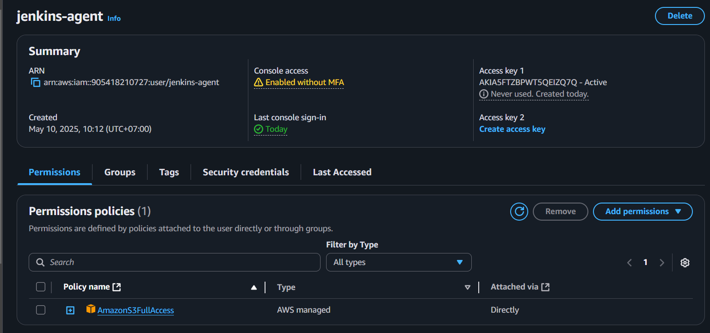
</p>

<p align="left">
    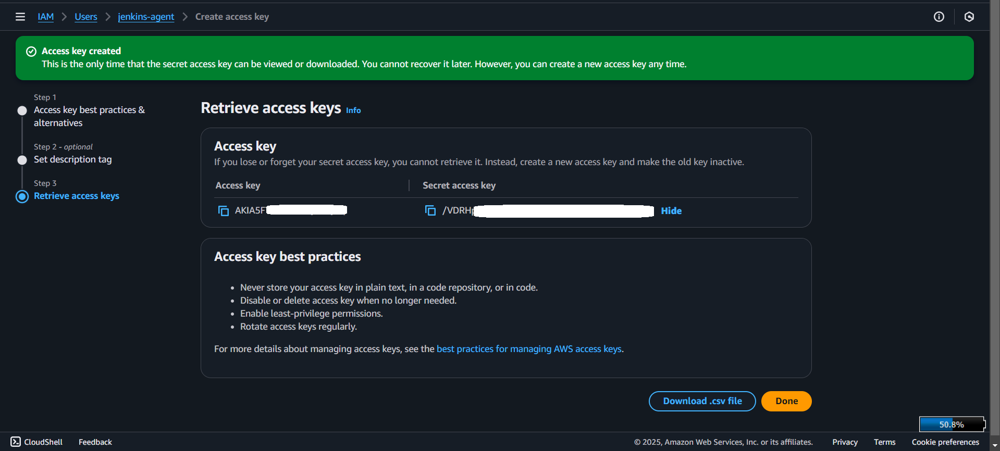
</p>

**Security Considerations:**
- IAM role follows principle of least privilege
- S3 bucket has encryption enabled
- Credentials are securely stored in Jenkins

Jenkins will execute this line to download the secrets.yaml file  
```bash
Write-Host "Configuring AWS CLI..."
aws configure set aws_access_key_id "$Env:AWS_ACCESS_KEY_ID"
aws configure set aws_secret_access_key "$Env:AWS_SECRET_ACCESS_KEY"
aws configure set default.region us-east-1
```

### Stage: Build Images

#### Objective:
Build Docker images for the 3 main components:
> These are the image names that will replace [image_name] below:

- `dify-api`
- `dify-web`
- `dify-plugin-daemon`

1. The pipeline navigates to the respective directories for each component, as outlined in the local steps above.
2. The script executes the following commands:
     ```powershell
     minikube -p minikube docker-env --shell=powershell | Invoke-Expression
     docker build -t [image-name]:local .
     ```

Once the images are built, to make them accessible as per the goals above, port forwarding must be configured since this is running in a Minikube environment.

<p align="left">
    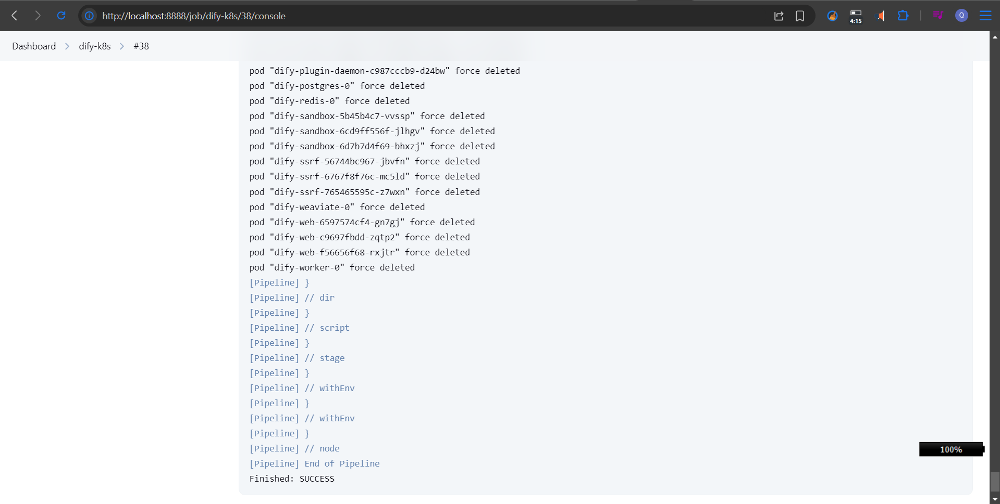
</p>

Manually, run the following command:
```bash
kubectl port-forward svc/dify-nginx 8008:80 -n dify
```

<p align="left">
    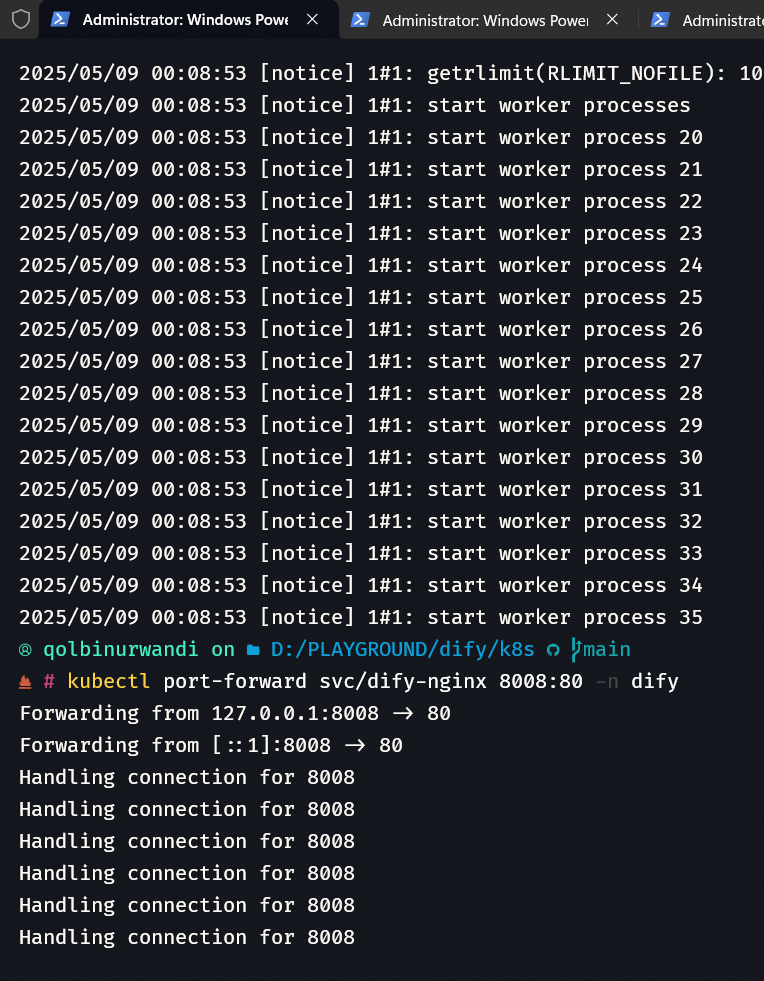
</p>

Tada! The application is now successfully running at http://localhost:8008/apps.

<p align="left">
    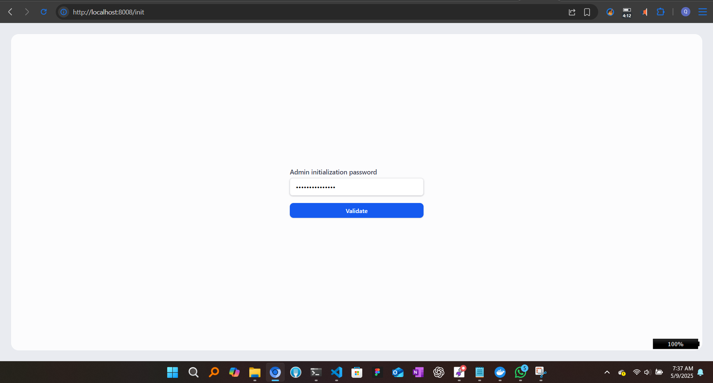
</p>
<p align="left">
    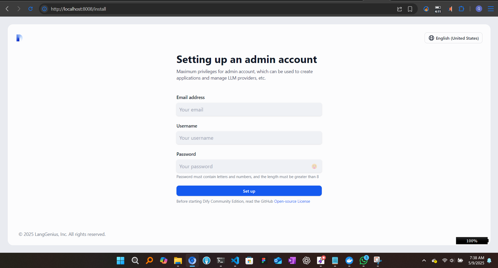
</p>
<p align="left">
    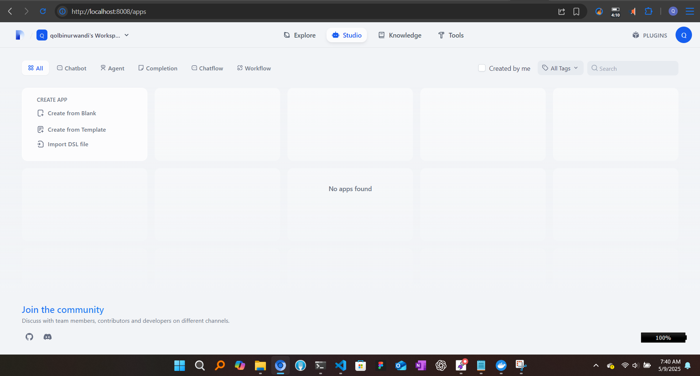
</p>
<p align="left">
    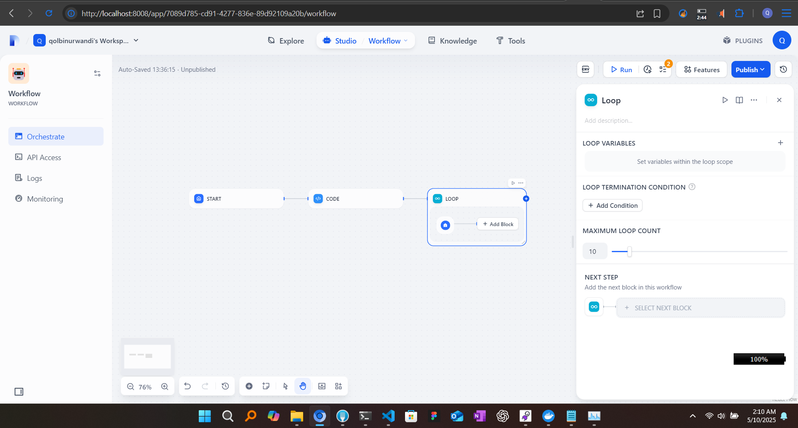
</p>
<p align="left">
    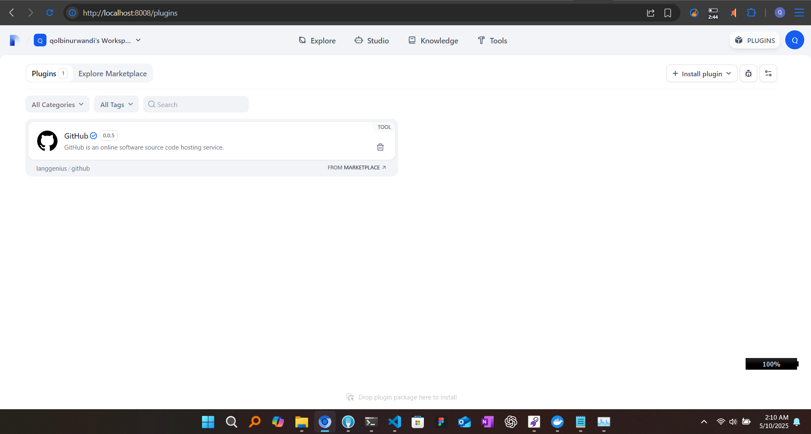
</p>

### Post-Success Actions

When the build succeeds, the following cleanup scripts will execute:

```powershell
# Remove sensitive secrets file
Remove-Item -Path ./secrets.yaml -Force

# Clean up unused Docker objects
docker system prune -f  
```

## End
Thank you for coming by!